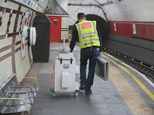
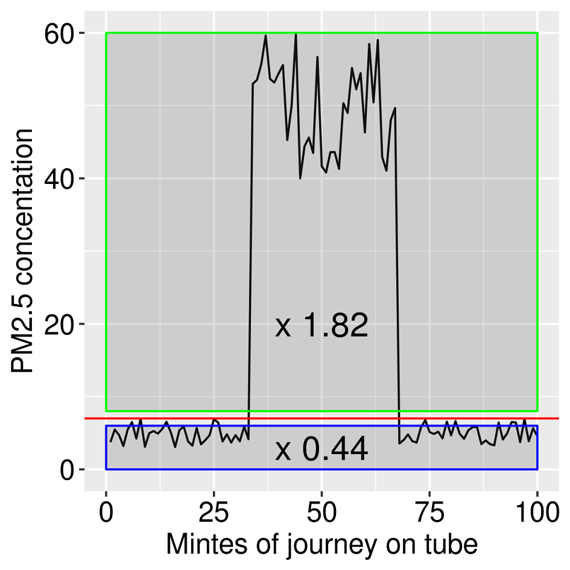
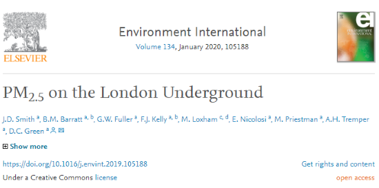

```{r setup, include=FALSE}
knitr::opts_chunk$set(echo = FALSE)
```

# Introduction

## About me
- MSc in GIS at UCL
- PhD / Researcher at King's College London
- The London Hybrid Exposure Model / Air quality GIS 'stuff'

    

- Now at Guy Carpenter (Model development, Re-insurance)
  
## Why measure air on the tube

- Exposure to particles on subway systems > important

- Seaton et al 2005, but ...
    - Tox. mechanisms
    - Susceptible populations
    - Analytical techniques

# Aims

## What we tried to do

- Measure variations in PM<sub>2.5</sub> between lines and stations
- Characterise the chemical composition
- Calculate calibration factors for optical instruments
- Provide a spatially resolved dataset for future analysis

<p align="center">

</p>

# Method

## Mobile Measurement campaign

- ~~TSI AM510 SidePak (PM2.5) + Philips Aerasense (numbers and size of particles)~~
- ~~31 hours, all lines~~
- ~~89% of stations (NE Central, SW Piccadilly)~~

- A long time down there with some fancy science equipment
<p align="center">

</p>

## Geo-tagging data

- Need to link air quality measurements to locations
- No GPS signal on large sections of the network
- Considered using timetables / interpolating between known locations
- Ended up using a notepad

  

## Characterisation & Calibration

- ~~Particles collected on filters over 5 days measuring composition & amount~~
- ~~High time resolution equipment installed~~
    - ~~Aethalometer / TSI Dustrak / 2 TSI Sidepaks / Micro-aethalometer~~
    
- Some *really* fancy equipment on the platform at Hampstead

{width=40%, style="display: inline; margin: 0 auto"} {width=40%, style="display: inline; margin: 0 auto"}

## Passenger-weighted stations

- 2015 tap in/tap out, Underground performance report
- Annual in/out for each station
- Mean PM<sub>2.5</sub> measured at each station
- Passenger rank * air quality rank = passenger-weighted ranking

{width=400, height=250, style="display: block; margin: 0 auto"}

## Spatial representation of the tube

<p align="center">

</p>

# Results

## Calibration factors

- Linear model to calculate correction factors for mobile monitoring equipment
- Mobile monitoring equipment co-located in tube station v. outdoor

{width=300, height=300, style="display: block; margin: 0 auto"}

## The Victoria Line  {.columns-2}

<p align="center">

</p>

<p align="center">

</p>

## Line averages

{width=640, height=512, style="display: block; margin: 0 auto"}

## Station depth 1

{width=736, height=520, style="display: block; margin: 0 auto"}

## Station depth 2

{width=670, height=473, style="display: block; margin: 0 auto"}

## Depth on the Central Line

<p align="center">

</p>

## PM<sub>2.5</sub> Map

<p align="center">

</p>

## PM<sub>2.5</sub> online map

[Online](http://www.erg.kcl.ac.uk/research/home/projects/TubeMapPM25.html)
<p align="center">

</p>

## Passenger-weighted stations

<p align="center">

</p>

## Origin-Destination matrix

<p align="center">

</p>

## Characterisation

<p align="center">

</p>

# Conclusions

## Conclusions

- ~~Particles tend to be larger in diameter than those at background or roadside environments~~
- ~~More particles~~
- ~~PM<sub>2.5</sub> varied between lines & locations~~
    - ~~lowest Hammersmith & City (Mean 25 µg/m3), similar to roadside~~
    - ~~highest Victoria (381 µg/m3), 15 x higher than roadside~~
- There's lots, they're bigger than exhaust, and it really varies

## Conclusions 2

- Relationship between 'depth' and air quality
- Oxford Circus, Waterloo, London Bridge, Victoria and Vauxhall = bleurgh
- We now know what most of it is
- Other studies need to re-evaluate

# What next

## What was planned

- ~~Characterise the remaining 11%~~
- ~~More measurements accross the network to improve understanding~~
    - ~~train frequency~~
    - ~~passenger numbers~~
    - ~~time of year~~
- ~~Interventions?~~
- ~~Develop inclusion in exposure modelling~~

## What happened

{width=40%, style="display: block; margin: 0 auto"} <!--{width=30%}-->

# The end

## Publication, Contact & Data

{style="display: block; margin: 0 auto"}
[https://data.mendeley.com/datasets/tv56txbpcw/1](https://data.mendeley.com/datasets/tv56txbpcw/1)
<br>

 james.david.smith@gmail.com

 [TheRealJimShady](http://twitter.com/therealjimshady)

