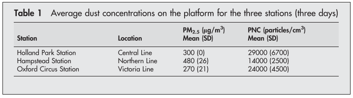
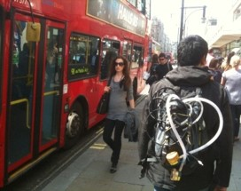
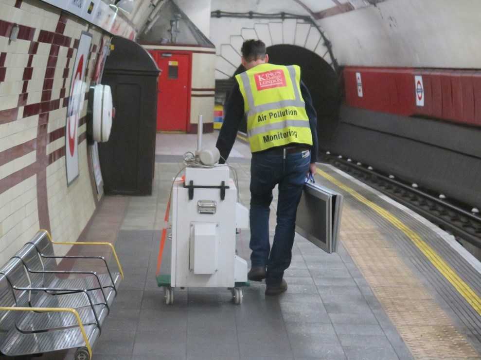
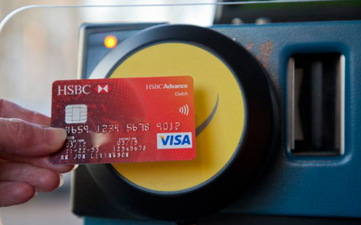
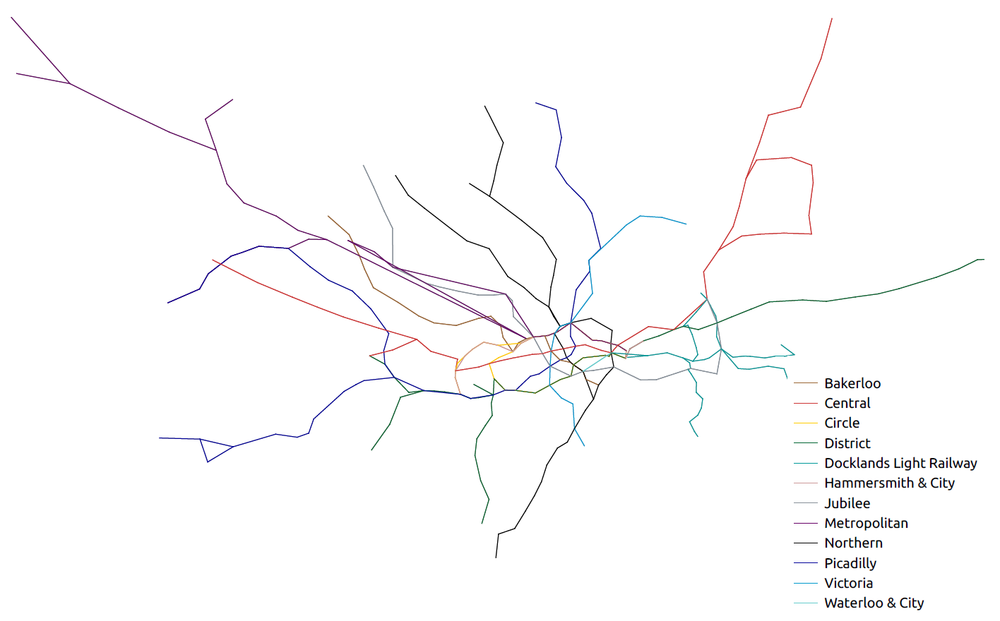
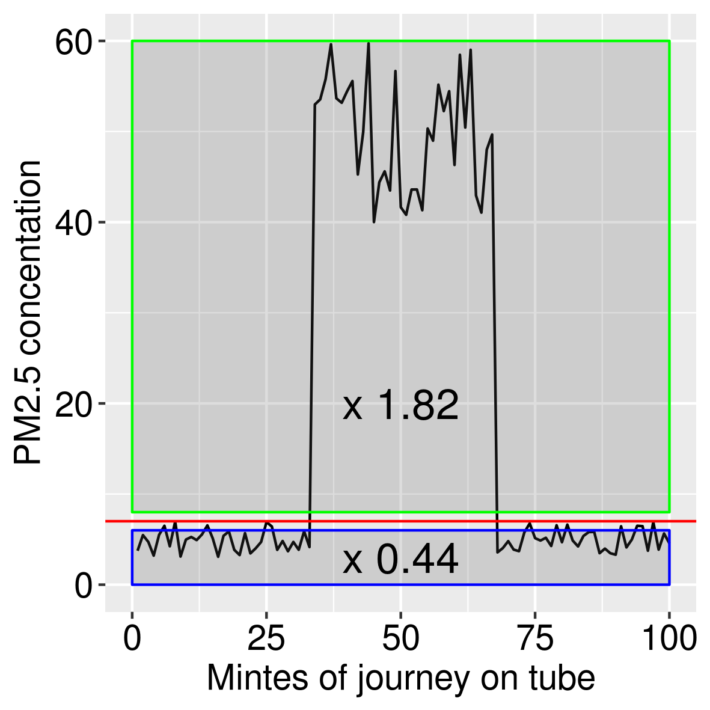
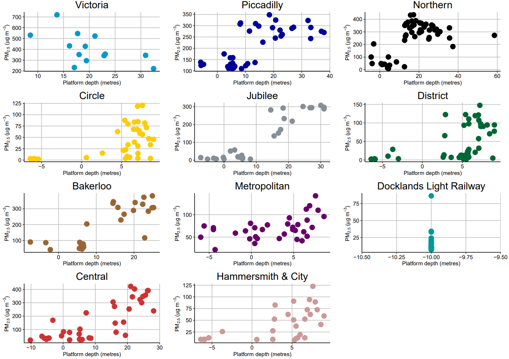
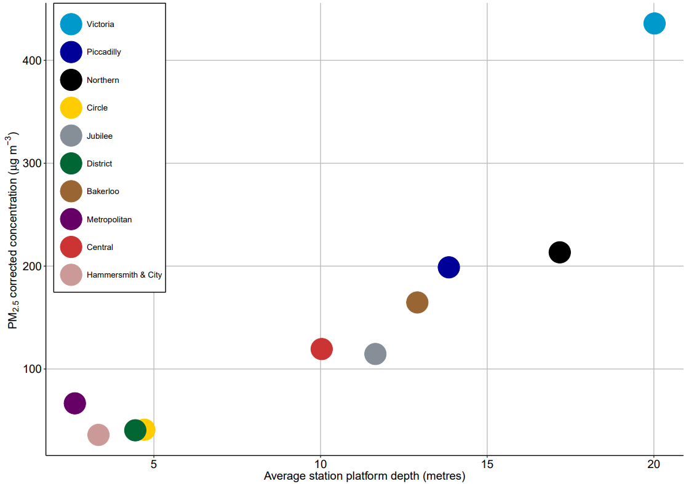
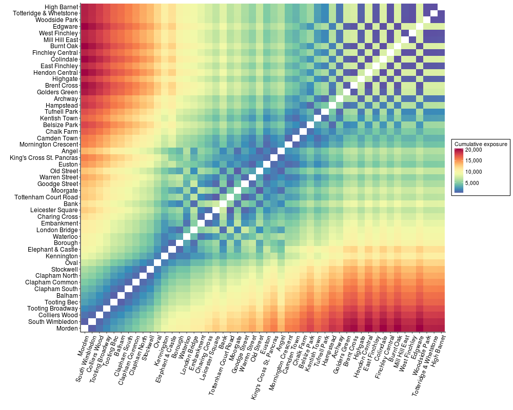
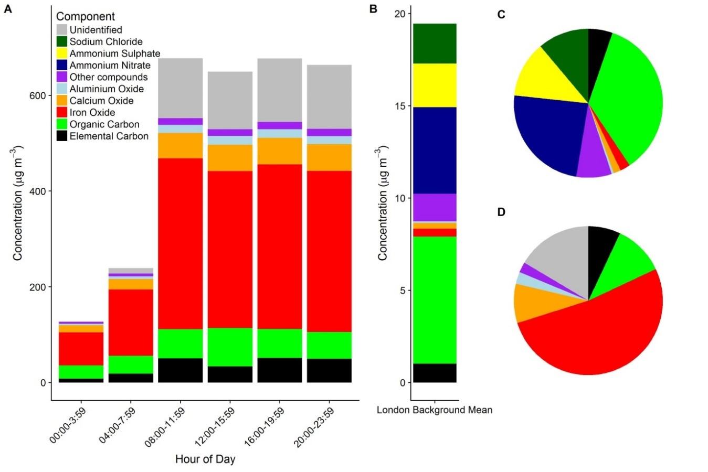

```{r setup, include=FALSE}
knitr::opts_chunk$set(echo = FALSE)
```

# Introduction

## Why me

- Environmental Research Group
- PhD
- The London Hybrid Exposure Model
- A Game of Thrones

<p align="center"> 

</p>
  
## Why now

- Exposure to particles on subway systems > important

- Seaton et al 2005, but ...
    - Tox. mechanisms
    - Susceptible populations
    - Analytical techniques
    
<p align="center"> 

</p> 

# Aims

## What we tried to do

- Measure variations in PM<sub>2.5</sub> between lines and stations
- Characterise the chemical composition
- Calculate calibration factors for optical instruments
- Provide a spatially resolved dataset for future analysis

<p align="center">

</p>

# Method

## Campaign One

- COPD Study 
- 22 journeys alternating between Oxford Street / Hyde Park
- TSI AM510 SidePak for PM2.5
- Philips Aerasense for ultrafine particle number and mean particle diameter

<p align="center">

</p>

## Campaign Two

- Same equipment
- 31 hours
- All lines
- 89% of stations (NE Central, SW Piccadilly)

<br>
<p align="center">

</p>

## Calibration

- Hampstead Station platform v. overground
- One month
- Filters v. TSI AM510 SidePak

<br>
<br>
<p align="center">

</p>

## Characterisation

- Something here from Dave.

## Passenger-weighted stations

- 2015 tap in/tap out, Underground performance report
- Annual in/out for each station
- Mean PM<sub>2.5</sub> measured at each station
- Passenger rank * air quality rank = passenger-weighted ranking

<p align="center">

</p>

## Spatial representation of the tube

<p align="center">

</p>

# Results

## Calibration factors

<p align="center">

</p>

## The Victoria Line  {.columns-2}

<p align="center">

</p>

<p align="center">

</p>

## Environment comparisons

<p align="center">

</p>

## Line averages

<p align="center">

</p>

## Station depth 1

<p align="center">

</p>

## Station depth 2

<p align="center">

</p>

## Depth on the Central Line

<br>
<br>
<p align="center">

</p>

## Passenger-weighted stations

<p align="center">

</p>

## Origin-Destination matrix

<p align="center">

</p>

## Characterisation

<p align="center">

</p>

# Conclusions

## Conclusions

* Particles larger in diameter than those at background or roadside environments, but more numerous
* Total PM<sub>2.5</sub> mass varied between lines & locations
    * lowest Hammersmith & City (Mean 25 µg/m3), similar to roadside
    * highest Victoria (381 µg/m3), 15 x higher than roadside
* General relationship between depth and air quality.
* Exposure - prioritise Oxford Circus, Waterloo, London Bridge, Victoria and Vauxhall
* 79% of PM<sub>2.5</sub> characterised
    * 47% iron oxide, 7% elemental carbon, 11% organic carbon, 14% metallic and mineral oxides
* Previous studies using light-scattering may under-report PM

# What next

## What next

* Characterise the remaining 11%
* More measurements accross the network to improve understanding
    * train frequency / passenger numbers / time of year

# The end

## Publication & Contact details

_Public health risks from respirable particles on the 'London Underground' metro network_

Smith, J.D., Green, D., Loxham, M. Priestman, M., Tremper, A., Mudway, I., Fuller, G., Nicolosi, E., Barratt, B.M.

<br>
<br>

 james.d.smith@kcl.ac.uk

 [TheRealJimShady](http://twitter.com/therealjimshady)

