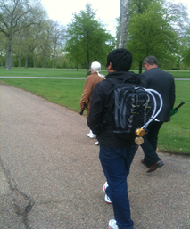

```{r setup, include=FALSE}
knitr::opts_chunk$set(echo = FALSE)
```

## Why me?

- Environmental Research Group
- PhD
- The London Hybrid Exposure Model
- A Game of Thrones

<p align="center"> 

</p>
  
## Why, and why now?

- Exposure to particles on subway systems > important

- Seaton et al 2005, but ...
    - Tox. mechanisms
    - Susceptible populations
    - Analytical techniques
    
<p align="center"> 

</p> 

## What we tried to do?

- Measure variations in PM<sub>2.5</sub> between lines and stations
- Characterise the chemical composition
- Calculate calibration factors for optical instruments
- Provide a spatially resolved dataset for future analysis

## Campaign One

- COPD Study 
- 22 journeys alternating between Oxford Street / Hyde Park
- TSI AM510 SidePak for PM2.5
- Philips Aerasense for ultrafine particle number and mean particle diameter

 

## Campaign Two

- Same equipment
- 31 hours
- All lines
- 89% of stations (NE Central, SW Piccadilly)

<br>
<p align="center">

</p>

## Characterisation & calibration

- Hampstead
- One month
- Filters v. TSI AM510 SidePak

## The end

_Public health risks from respirable particles on the 'London Underground' metro network_

Smith, J.D., Green, D., Loxham, M. Priestman, M., Tremper, A., Mudway, I., Fuller, G., Nicolosi, E., Barratt, B.M.

<br>
<br>

 james.d.smith@kcl.ac.uk

 [TheRealJimShady](http://twitter.com/therealjimshady)

